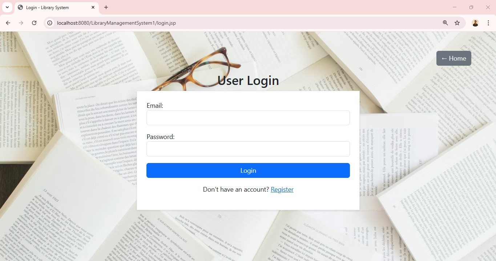
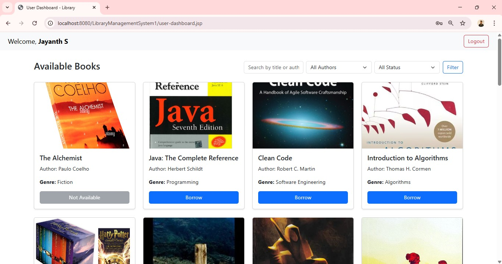
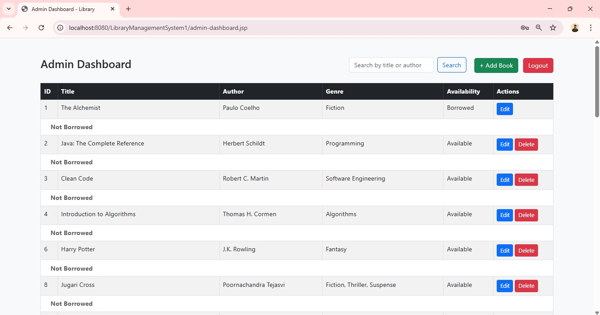
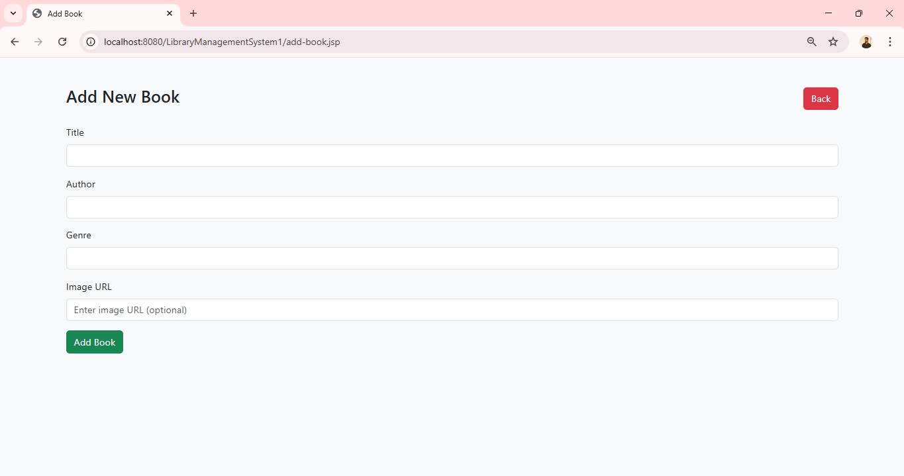

# 📚 Library Management System

A dynamic web-based **Library Management System** built using **Java, JSP, Servlets, JDBC**, and **MySQL**, styled with **Bootstrap 5**. It allows **admins** to manage books and **users** to browse, borrow, and return books.

---

## 🚀 Features

- 🧑‍💼 **Admin Panel**
  - Login with credentials
  - Add / Edit / Delete books
  - View all book listings and their current status
  - See latest borrower and borrow status

- 👨‍🎓 **User Panel**
  - Login and register
  - Browse available books
  - Borrow and return books
  - View current borrow status

- 📊 **Real-time Status**
  - Displays whether books are available or borrowed
  - Shows last borrowed user with timestamp

- 🖥️ **UI/UX Inspired by E-commerce**
  - Responsive, modern layout inspired by platforms like **Myntra/Flipkart**
  - Clean Bootstrap-styled tables and buttons

---

## 💻 Tech Stack

| Technology | Description |
|------------|-------------|
| ☕ Java     | Backend logic and Servlets |
| 🖥️ JSP      | Dynamic frontend |
| 🔗 JDBC     | Database connection |
| 🐬 MySQL   | Database |
| 🎨 Bootstrap 5 | Styling |
| 🌐 HTML + CSS | UI Components |
| 🧠 OOP      | Object-Oriented Design |

---

## 🖼️ Screenshots

### 🔐 Login Page


---

### 👤 User Login


---

### 📋 User Dashboard


---

### 🔐 Admin Dashboard


---

### ➕ Add Book (Admin)

---

## 🛠️ Setup

1. Clone this repository:
   ```bash
   git clone https://github.com/Jayanth175/LibraryManagementSystem.git

Import the project into Eclipse IDE.

Configure your MySQL database:

Database Name: library_db

Table: books, users, borrowed_books

Import schema if needed.

Run on Apache Tomcat Server via Eclipse.

📬 Contact
👤 Jayanth S
📍 Bangalore, India
📧 jayanthgowda170@gmail.com
🔗 LinkedIn Profile:https://www.linkedin.com/in/jayanth-s/

MySQL – Open-source database


---


